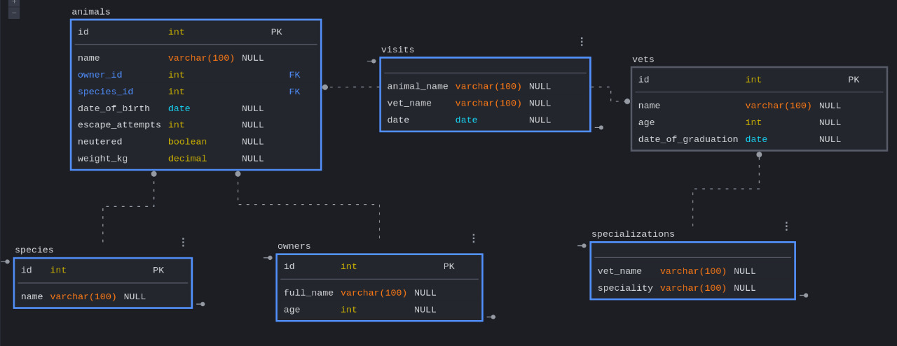

# Project Name

Vet Clinic

# Description the project.

This is a practice project for using SQL Databases.

## Built With

- PostgreSQL

## Diagram

## Authors

👤 **Author1**

- GitHub: [@Peter1907](https://github.com/Peter1907)
- Twitter: [@Peter_Beshara_](https://twitter.com/Peter_Beshara_)
- LinkedIn: [LinkedIn](https://www.linkedin.com/in/peter-beshara-b33681241/)

👤 **Author2**

- GitHub: [@MarcoAurelioAntonio](https://github.com/MarcoAurelioAntonio)
- Twitter: [@gustavoporcilio](https://twitter.com/gustavoporcilio)
- LinkedIn: [Gustavo Porcilio](https://www.linkedin.com/in/gustavo-porcilio-4496a223a/)

## 🤝 Contributing

Contributions, issues, and feature requests are welcome!

You can clone the repo using this link (https://github.com/Peter1907/vet-clinic.git)

Feel free to check the [issues page](https://github.com/Peter1907/vet-clinic/issues).

## Show your support

Give a ⭐️ if you like this project!

## Acknowledgments

- A big kudos to everyone who worked hard to make this project a success.

## 📝 License

This project is CC licensed.
